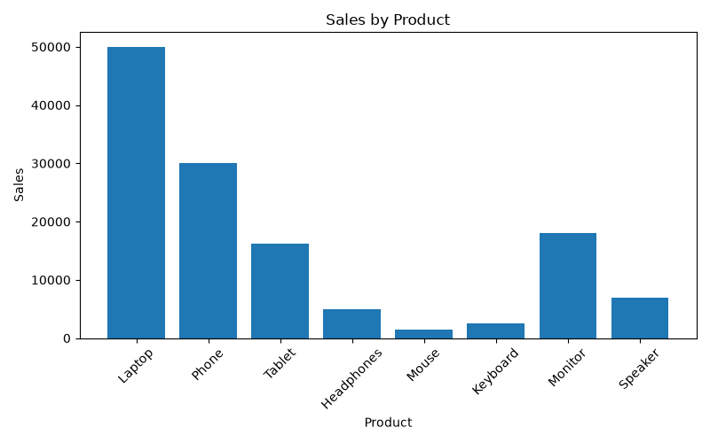

# Data Cleaning & Reporting Automation

## 📌 Project Overview
This project automates the process of cleaning sales data, generating summary reports, and visualizing sales information using Python. It reads raw sales data from a CSV file, performs data cleaning, calculates key statistics, generates a report, and creates a bar chart for better analysis.

---

## 🎯 Objectives

- Read sales data from a CSV file.
- Remove duplicate records.
- Handle missing values.
- Generate summary statistics.
- Create a sales visualization.
- Save cleaned data and reports automatically.

---

## 🛠️ Technologies Used

- Python
- Pandas
- Matplotlib

---

## 📂 Project Structure

```
Data-Cleaning-Reporting-Automation/
│
├── automation.py
├── README.md
├── requirements.txt
│
├── data/
│   └── sales_data.csv
│
└── reports/
    ├── cleaned_data.csv
    ├── summary_report.txt
    ├── sales_chart.png
    └── output_screenshot.png
```

---

## 📊 Dataset

The dataset contains:

- Product Name
- Category
- Sales
- Quantity

The project cleans the dataset by removing duplicate records and handling missing values before generating reports.

---

## ✨ Features

- ✅ Reads CSV dataset
- ✅ Removes duplicate records
- ✅ Handles missing values
- ✅ Calculates Total Sales
- ✅ Calculates Average Sales
- ✅ Finds Highest and Lowest Sales
- ✅ Generates Summary Report
- ✅ Creates Sales Bar Chart
- ✅ Saves Cleaned Dataset

---

## ▶️ How to Run

### Install Dependencies

```bash
pip install -r requirements.txt
```

### Run the Project

```bash
python automation.py
```

---

## 📁 Generated Output

After execution, the following files are automatically created inside the **reports** folder:

- cleaned_data.csv
- summary_report.txt
- sales_chart.png

---

# 📸 Project Execution Output

The screenshot below shows the successful execution of the project, including the terminal output, generated sales chart, and confirmation that all reports were created successfully.


---

## 📊 Sales Chart

The project automatically generates the following sales visualization.



---

## 🚀 Future Enhancements

- Export reports as PDF
- Send reports through Email
- Connect with SQL Database
- Build an Interactive Dashboard
- Automate Scheduled Report Generation

---

## 👩‍💻 Author

**Devadharshini E**

B.E. Computer Science and Engineering (Cybersecurity)

Passionate about Python, SQL, Power BI, and Data Analytics.

---

## ⭐ Acknowledgement

This project was developed as part of a Data Analytics Internship to demonstrate practical skills in data cleaning, automation, reporting, and visualization using Python.
